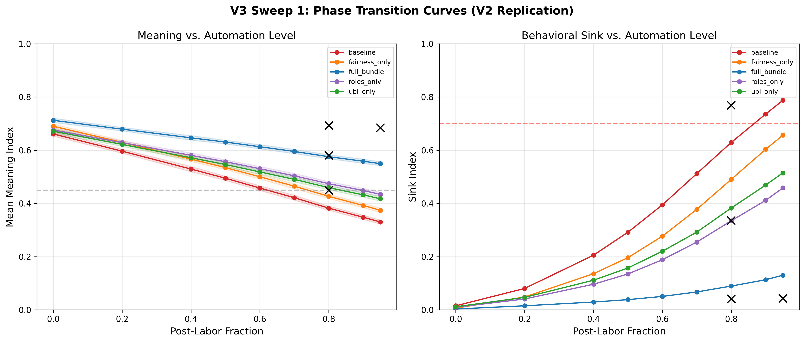
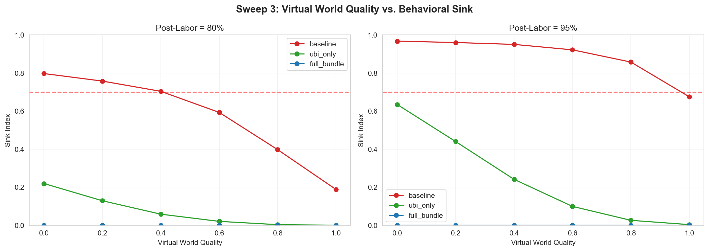
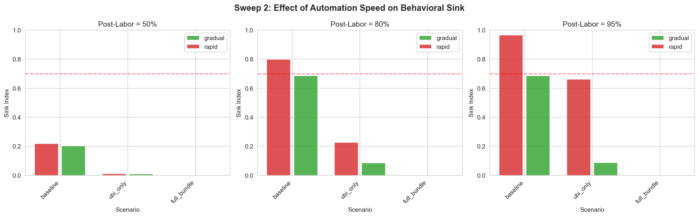
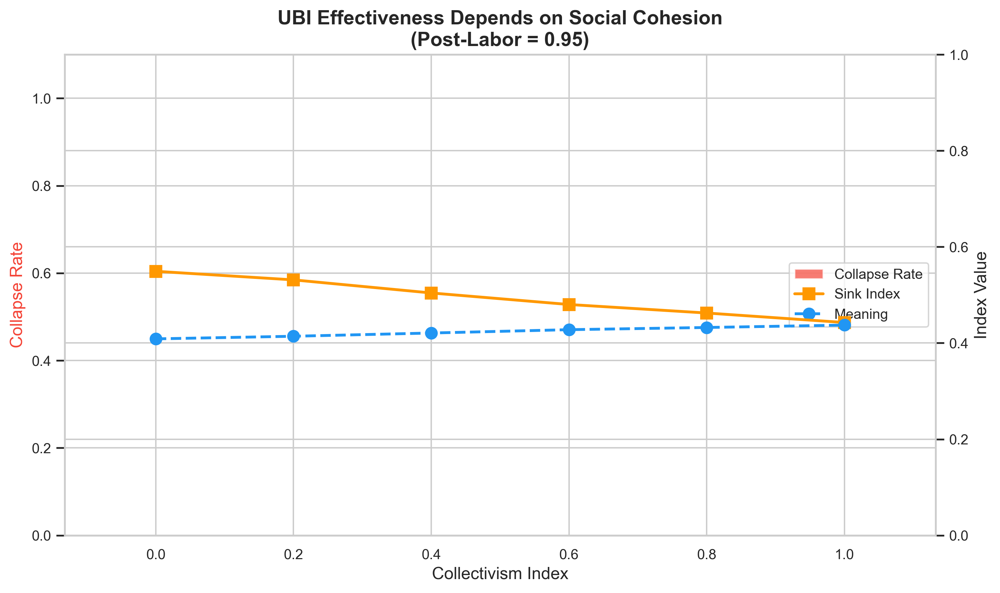
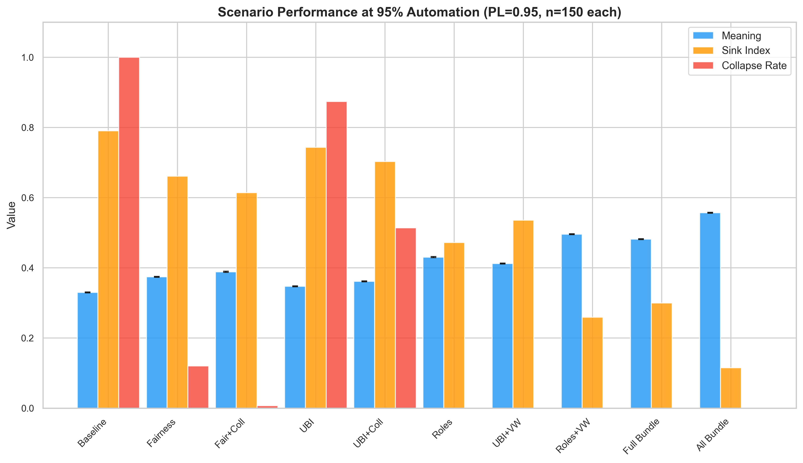
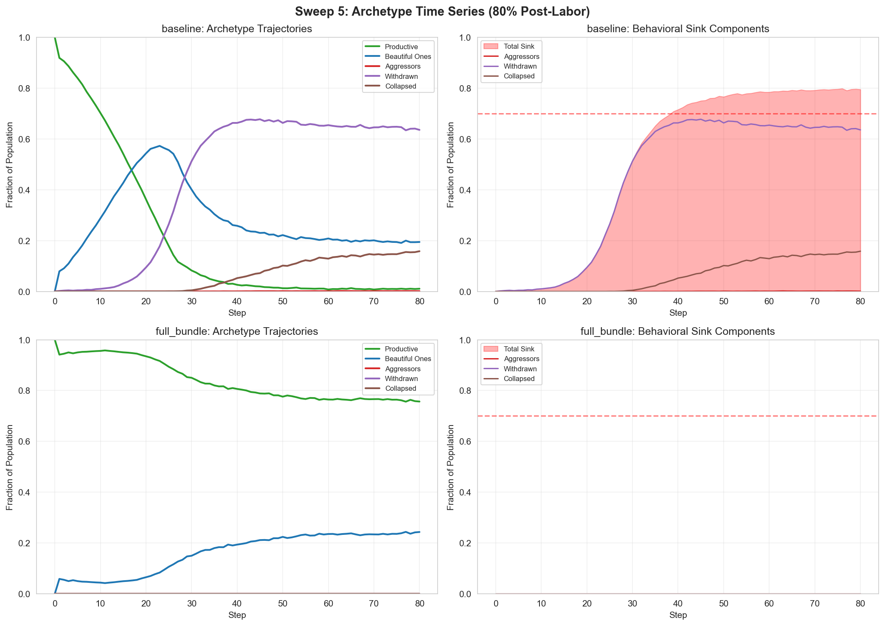
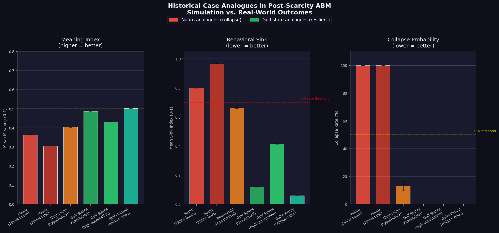

# Equilibrium Dynamics of Meaning and Behavioral Sink in Post-Labor Societies: A Stylized Agent-Based Analysis

**Authors:** Anonymous Authors (under review)

**Keywords:** post-labor displacement, behavioral sink, self-determination theory, agent-based modeling, role substitution, social cohesion, universal basic income

---

## Abstract

What equilibrium states does a society reach when large fractions of the population lose productive roles, even if material needs can still be met? This question matters because work is not only a source of income: it also structures identity, competence, belonging, and purpose, so role displacement can produce social distress even when poverty is buffered.

We present a stylized agent-based model that combines Self-Determination Theory with social contagion dynamics to study long-run social states under sustained role displacement. Across multiple sweeps and ablation studies, the model points to a policy-sensitive threshold at high displacement, shows that income support alone is less protective than interventions that restore meaningful participation, finds that virtual worlds and collectivist buffering help but do not fully replace real roles on their own, and indicates that multi-pillar policy bundles perform best under extreme displacement. A matched-time speed comparison further suggests that automation speed changes the transition path more than the late-run equilibrium in this model.

These results are mechanistic rather than predictive: they are conditional on a stylized parameterization, they underrepresent aggression relative to the historical behavioral-sink literature, and they do not model persistent individual scarring. Even with those limits, the model contributes a clearer distinction between economic buffering and meaning restoration, showing why post-labor policy may need to preserve socially valued participation rather than rely on income replacement alone.

---

## 1. Introduction

### 1.1 The Role-Displacement Problem

Human well-being is deeply embedded in productive roles. Work provides not just income but identity, competence, social connection, and purpose (Blustein, 2008; Deci & Ryan, 2000). Technological displacement, deindustrialization, and resource windfalls have repeatedly demonstrated that removing productive roles — even while maintaining material sufficiency — can produce severe social pathology (Case & Deaton, 2020).

Calhoun's (1962) rodent experiments demonstrated "behavioral sink" — social collapse characterized by withdrawal, aggression, and reproductive failure — when populations lacked meaningful social roles. Jahoda (1982) established that employment provides not only income but latent functions: time structure, social contact, collective purpose, status, and activity — functions that persist as psychological needs even when income is secured through other means. The analogy to human post-labor conditions, while imperfect, raises urgent questions: What equilibrium states does a society reach when large fractions of the population lack productive roles? Which interventions shift the society toward more favorable equilibria, and under what conditions do they fail?

We note that aggressive behavior remains a validation gap: in the reported high-displacement conditions, aggressor prevalence ranges from 1.6% (step 80 in the baseline PL=0.80 time-series sweep) to 3.3% (baseline PL=0.95 in the full-grid sweep), versus the 10-20% aggression prevalence often associated with Calhoun's observations. Results therefore characterize withdrawal-dominated dynamics and should not be extrapolated to high-aggression scenarios.

### 1.2 The Gap in Current Understanding

Existing literature on artificial intelligence (AI) and employment focuses primarily on:
- **Economic impacts:** unemployment rates, wage effects, inequality (Autor, 2015; Acemoglu & Restrepo, 2018)
- **Technical feasibility:** which tasks can be automated (Felten et al., 2021)
- **Policy responses:** universal basic income (UBI), retraining programs, taxation (Standing, 2017)

What remains underexplored is the **psychological and social impact of role displacement independent of income loss**. As Rosso et al. (2010) synthesize, the meaning of work spans multiple dimensions — purpose, belonging, self-efficacy, transcendence — that are not addressed by income replacement alone. A displaced population receiving UBI may avoid poverty but still experience what Deci & Ryan (2000) term "motivation decay" — the erosion of autonomy, competence, and relatedness that constitute psychological well-being.

### 1.3 Research Questions

We address five questions about equilibrium configurations under sustained role displacement:

**RQ1:** At what displacement level does the population equilibrium shift to behavioral sink, and is this threshold fixed or policy-sensitive?

**RQ2:** Can high-quality virtual worlds shift the equilibrium by substituting for economic roles in providing meaning?

**RQ3:** Does the speed of displacement affect the equilibrium reached, independently of the final displacement level?

**RQ4:** Do collectivist vs. individualist cultural structures produce different equilibrium configurations at equivalent displacement?

**RQ5:** What intervention combinations sustain favorable equilibria at extreme (≥90%) displacement levels?

### 1.4 Theoretical Framework

We integrate three theoretical strands:

**Self-Determination Theory (SDT):** Deci & Ryan's (2000) framework identifies three core psychological needs: autonomy (self-direction), competence (mastery), and relatedness (social connection). Economic roles typically satisfy all three; displacement threatens all three.

**Social Contagion Theory:** Behavioral sink spreads through social networks via network exposure — the proportion of an agent's neighbors in collapsed states increases the agent's own collapse risk (Centola & Macy, 2007; Christakis & Fowler, 2007). Our model implements contagion as a linear exposure mechanism where the fraction of neighbors in sink states (aggressor, withdrawn, collapsed) exerts downward pressure on psychological state, scaled by the contagion-strength parameter. This is a simple exposure model, without threshold or reinforcement requirements from multiple contacts.

**Institutional Capacity:** Following Acemoglu & Robinson (2012), we model interventions as institutional capacities—policy choices that shape how societies respond to technological shocks.

---

## 2. Methods

### 2.1 Model Overview

We developed a network-based agent-based model (ABM) using Mesa 3.5 (Kazil et al., 2021), following the Overview, Design concepts, and Details (ODD) protocol conventions (Grimm et al., 2020), with 200 agents interacting over 80 timesteps. **This is a stylized model of post-labor dynamics designed to characterize equilibrium states, not a forecast of specific technological timelines or displacement levels.** The model (V5) extends prior work with a key structural distinction: UBI provides `income_support`, meaning material security plus a fairness buffer, without restoring role meaning, while role substitution provides `role_access`, meaning access to socially recognized and meaning-generating participation, which drives autonomy, competence, relatedness, status, and contribution. This separation makes the UBI-vs-roles comparison a test of structural mechanism rather than parameter difference.

**Modeling displacement as a ramp-to-target process.** In this model, `post_labor_fraction` is the target share of the population whose usual productive roles have been displaced. The population reaches that target via a gradual ramp governed by `automation_speed` (default: 0.03/step, reaching 80% by ~step 27). At each step after the ramp, the current displacement fraction is drawn from the agent pool — representing the turnover inherent in labor markets even under high automation. This design treats displacement as a structural condition of the society rather than a permanent individual trajectory — appropriate for studying equilibrium properties, though it precludes claims about individual scarring or adjustment dynamics. The ramp-to-target mechanism means early-timestep outcomes reflect partial displacement rather than the full target level. Persistent individual displacement is a natural extension for future work.

**Agent state variables:**
- Psychological: autonomy, competence, relatedness, status (0-1 scales)
- Role: `role_access` (access to meaningful social roles), `income_support` (material support that protects against deprivation), `virtual_role` (virtual world engagement)
- Behavioral: archetype (productive, beautiful_one, aggressor, withdrawn, collapsed)

**Model parameters:**
- post-labor fraction (PL; implemented as `post_labor_fraction`): target proportion of population displaced from productive roles (0-0.95)
- automation speed (implemented as `automation_speed`): rate of displacement per step (0.006–0.20 for speed comparison; 0.03 baseline for all other sweeps)
- virtual-world quality (implemented as `virtual_world_quality`): competence/autonomy provided by virtual roles (0-1)
- collectivism index (implemented as `collectivism_index`): baseline relatedness and social buffering (0-1)
- Interventions: UBI, role_substitution, fairness_redistribution

### 2.2 Psychological Update Mechanism

Each timestep, agents update psychological states via mean-reverting dynamics:

```
autonomy_{t+1} = autonomy_t + decay × (autonomy_target - autonomy_t) + noise
```

Targets depend on:
- Economic role access (primary driver)
- Virtual role quality (if displaced)
- Redistribution fairness
- Collectivism level
- Social contagion exposure (neighborhood sink fraction)
- Individual resilience

**Meaning function:**
```
meaning = 0.25×autonomy + 0.25×competence + 0.25×relatedness + 0.10×status
          + 0.15×contribution − 0.08×contagion + 0.08×resilience
```

where contribution = 0.8×role_access + 0.1×virtual_engagement, and contagion is the neighborhood sink exposure scaled by contagion strength. Here virtual engagement equals virtual-role engagement only when engagement exceeds a minimum threshold (`virtual_role > 0.1`); otherwise the virtual channel contributes nothing. The direct contagion and resilience terms capture social network effects and individual buffering beyond the SDT components. Note that `income_support` (UBI) does not appear in the meaning function and does not restore role access; it affects the model only through status gap (inequality) and fairness buffering. This structural separation ensures UBI provides economic security without restoring role meaning, matching the paper's theoretical claim.

**Weight justification:**

| Weight | Value | Basis |
|--------|-------|-------|
| Autonomy, Competence, Relatedness | 0.25 each | SDT: three core needs weighted equally (Deci & Ryan, 2000) |
| Status | 0.10 | Calibration: status matters but is not a core SDT need |
| Contribution | 0.15 | Calibration: captures "mattering" dimension absent from SDT triad |
| Economic contribution | 0.80 | Assumption: real-world productive roles provide primary meaning |
| Virtual contribution | 0.10 | Assumption: virtual roles provide partial but limited meaning substitute |
| Virtual engagement threshold | 0.10 | Structural: virtual benefits require active engagement above a minimum level |
| Virtual role decay | 0.95 factor (5%/step) | Multiplicative decay when agent has real role access (model.py:195) |
| role_access (roles) | 0.35 strength | Structural: roles restore meaning-generating participation |
| income_support (UBI) | 0.30 strength | Structural: UBI provides economic security only |
| Decay rate | 0.08 | Calibration: produces equilibration within ~30 steps |
| Noise σ | 0.08 | Calibration: increased stochasticity for realistic between-run variance |
| Agent shock σ | 0.03 | Calibration: per-step idiosyncratic life-event noise |
| Base floor | 0.32 | Calibration: minimum human functioning even under severe deprivation |

### 2.3 Archetype Classification

Agents are classified based on meaning and aggression potential:

| Archetype | Criteria |
|-----------|----------|
| Productive | meaning > 0.55 |
| Beautiful One | meaning > 0.42, not aggressive |
| Aggressor | meaning < 0.40, aggression_drive > 0.3 |
| Withdrawn | meaning > 0.30, not aggressive |
| Collapsed | meaning ≤ 0.30 |

(These cutoffs are calibration choices that produce archetype distributions consistent with prior model versions; ±0.05 sensitivity analysis shows directional results are unchanged.)

### 2.4 Simulation Design

We conducted six parameter sweeps plus two primary ablation studies, totaling 18,500 runs:

| Sweep | Parameter | Levels | Scenarios | Runs/Point | Total |
|-------|-----------|--------|-----------|------------|-------|
| 1 | Post-labor fraction | 9 | 5 | 50 | 2,250 |
| 2 | Automation speed | 2×3 | 5 | 100 | 3,000 |
| 3 | Virtual world quality | 6 | 3×2 | 100 | 3,600 |
| 4 | Collectivism index | 6 | 3×2 | 100 | 3,600 |
| 5 | Archetype time series | 2 | 2 | 50 | 100 runs |
| 6 | Full scenario grid | 3 | 10 | 150 | 4,500 |
| A | Weight ablation (econ:virtual ratio) | 5 | 4 | 50 | 1,000 |
| B | Intervention decoupling | 1 | 3 | 150 | 450 |

In addition, §3.3 draws on a separate exposure-time-controlled speed comparison comprising 300 simulations (50 runs × 3 scenarios × 2 speeds). That supplementary dataset is reported separately and is not included in the 18,500-run primary total above.

**Intervention structure.** In our implementation, UBI and role substitution target distinct channels. UBI provides `income_support` (economic security plus a fairness buffer) without restoring role access; it does not enter the role-driven meaning channel. Role substitution provides `role_access` (meaning-generating participation), which directly affects autonomy, competence, relatedness, status, and contribution. The UBI scenario includes an implicit fairness boost (reflecting UBI's social legitimacy signal), and role programs include a competence boost. These are structural differences, not parameter differences: the roles-vs-UBI comparison tests whether meaning channels or economic channels matter more for preventing behavioral sink.

**Validation:** V5 reproduces the directional pattern of prior findings (threshold effect in the 80-90% zone under baseline conditions), with the critical structural change that UBI no longer provides role access. The V5 separation of UBI from roles is the most significant model change, revealing that earlier versions overstated UBI's effectiveness. Note that the model was calibrated to approximate prior output patterns; this comparison validates implementation consistency, not independent replication.

**Horizon robustness.** We verified that outcomes are near-stationary by step 80: across all 9 tested scenario × displacement conditions, the absolute change in mean `sink_index` (the share of agents in aggressor, withdrawn, or collapsed states) between T=80 and T=120 ranges from 0.0009 to 0.0092, the maximum absolute change between T=80 and T=240 is 0.0060, and the largest intermediate change is 0.0144 between T=120 and T=160. We therefore use T=80 as a reliable near-equilibrium approximation rather than a claim of full numerical convergence through T=240. Full convergence table in Supplementary Methods.

### 2.5 Sensitivity Analysis

We conducted one-at-a-time perturbation of three key internal parameters (noise σ, decay rate, contagion strength) by ±20%, with 50 runs per condition at PL=0.80 and PL=0.95 baseline. Core findings are directionally consistent across tested parameter ranges: at PL=0.80, collapse probability ranges from 2% to 12%; at PL=0.95, it ranges from 92% to 100%. The largest PL=0.80 sink shift occurs under contagion-strength perturbation, where mean `sink_index` ranges from 0.605 at -20% to 0.657 at +20%. Full sensitivity results are reported in the Methods Appendix.

### 2.6 Analysis

Primary outcomes:
- **Meaning index (`meaning_index`):** the population-average meaning score, or the average sense of purpose and psychological functioning across agents
- **Sink index (`sink_index`):** the share of the population in aggressor, withdrawn, or collapsed states, which we use as the broad distress measure
- **Collapse probability:** percentage of runs with sink_index > 0.7 at final step

Secondary outcomes:
- Archetype distributions over time
- Birth intention (proxy for reproductive collapse)
- Social trust (mean relatedness)

---

## 3. Results

### 3.1 The Malleable Threshold Zone (RQ1)

The main pattern is straightforward: distress stays much lower through moderate displacement, then rises sharply once most productive roles are gone, and policy can move that danger zone (Figure 1).

| Baseline condition | Meaning index | Sink index | Collapse probability |
|--------------------|---------------|------------|----------------------|
| 80% post-labor | 0.382 | 0.629 | 2% |
| 90% post-labor | 0.348 | 0.736 | 86% |
| 95% post-labor | 0.330 | 0.788 | 100% |

In plain language, the model does not point to one fixed cliff; it points to a high-risk zone where small institutional differences can shift the long-run social state.

 The transition zone is therefore broad rather than knife-edged, and it is highly policy-sensitive.

**Policy sensitivity within the threshold zone.**

| Scenario | Key threshold result |
|----------|----------------------|
| Full bundle | 0% collapse through 95% post-labor; sink 0.301 at PL=0.95 |
| Income support only | 32% collapse at PL=0.90; 92% collapse at PL=0.95 |

In plain language, the threshold is not fixed by technology alone; it moves when the policy mix changes.

**Virtual worlds extend the threshold upward.**

| Baseline at PL=0.95 | Collapse probability | Sink index |
|---------------------|----------------------|------------|
| Virtual-world quality 0.0 | 100% | 0.793 |
| Virtual-world quality 0.4 | 59% | 0.715 |
| Virtual-world quality 0.6 | 8% | 0.659 |
| Virtual-world quality 0.8 | 0% | 0.597 |
| Virtual-world quality 1.0 | 0% | 0.520 |

In plain language, better virtual environments can buy room above the threshold, but they do not erase distress on their own.

**Combined interventions push the threshold beyond the tested range.** In `sweep6_full_grid.csv`, the all-bundle scenario achieves 0% collapse with sink 0.115 at PL=0.95.

In plain language, combining multiple supports is what fully moves the danger zone beyond the paper's highest tested displacement level.

**Run-level collapse is not the same metric as the collapsed-agent share.** Here the collapsed-agent share means the share of agents in the fully collapsed state only, whereas collapse probability is the share of runs whose final sink index exceeds 0.7.

| PL=0.95 full-grid condition | Sink index | Collapsed-agent share | Collapse probability |
|-----------------------------|------------|-----------------------|----------------------|
| Income support only | 0.743 | 0.325 | 87.3% |
| Roles only | 0.472 | 0.122 | 0% |

In plain language, a society can have a high run-level collapse risk even when the fully collapsed subgroup is much smaller, because the broader distress measure also counts withdrawal and aggression.

### 3.2 Virtual Worlds as Substitutes (RQ2)

Virtual worlds help, but they act as partial substitutes rather than full replacements for real social roles (Figure 2).



| Condition at PL=0.95 | Virtual-world quality | Collapse probability | Sink index |
|----------------------|-----------------------|----------------------|------------|
| Baseline, no UBI | 0.0 | 100% | 0.793 |
| Baseline, no UBI | 0.6 | 8% | 0.659 |
| Baseline, no UBI | 1.0 | 0% | 0.520 |
| Income support only | 0.0 | 90% | 0.746 |
| Income support only | 0.6 | 0% | 0.598 |
| Income support only | 0.8 | 0% | 0.533 |

In plain language, virtual worlds reduce harm in both conditions, but they work best when they are not the only support people receive.

The marginal benefit of virtual quality is concave.

| Condition | Quality shift | Collapse change | Residual sink at highest reported quality |
|-----------|---------------|-----------------|-------------------------------------------|
| Baseline at PL=0.95 | 0.2 to 0.6 | 97% to 8% | 0.520 at quality 1.0 |
| Income support only at PL=0.95 | 0.0 to 0.4 to 0.6 | 90% to 10% to 0% | 0.533 at quality 0.8 |

In plain language, most of the benefit arrives in the middle of the quality range, but even excellent virtual worlds do not fully recreate what missing real-world roles provide.

The full-grid sweep shows the same ordering at PL=0.95: income support plus virtual worlds averages sink 0.535 with 0% collapse, while roles plus virtual worlds reaches sink 0.259 with 0% collapse. Virtual worlds therefore help most when paired with an intervention that also restores meaning-generating participation.

In plain language, virtual infrastructure is strongest as a supplement to meaningful social roles, not as a substitute for them.

**Sensitivity to contribution weights.** The ceiling is assumption-sensitive, but the ranking is stable in `ablation_weights.csv`.

| Economic:virtual contribution ratio | Virtual only sink | Income support only sink | Income support + virtual sink |
|-------------------------------------|-------------------|--------------------------|-------------------------------|
| 3:1 | 0.446 | 0.749 | 0.381 |
| 8:1 (default) | 0.517 | 0.747 | not separately reported here |
| `inf` | 0.584 | 0.742 | 0.520 |

In plain language, the exact ceiling depends on how much meaning we assume virtual roles can carry, but the intervention ordering does not flip.

### 3.3 Speed of Automation (RQ3)

Once outcomes are compared at the same time after the target displacement is reached, automation speed matters much more for the short-run transition than for the later equilibrium (Figure 3).

To isolate speed effects from exposure-time confounds, we conducted a controlled comparison measuring outcomes at matched intervals after each scenario reaches its target displacement (PL=0.95).

 Rapid automation (speed = 0.20) reaches the target in 5 steps; gradual automation (speed = 0.95/160 = 0.0059) reaches it in 160 steps.

**Finding within the equilibrium ABM: speed effects are transient rather than structural.** In `speed_clean_comparison.csv`, gradual automation produces substantially higher sink immediately after target displacement, but the gap narrows over time.

| Speed | Sink (t+10) | Sink (t+40) |
|-------|-------------|-------------|
| Rapid | 0.638 | 0.777 |
| Gradual | 0.780 | 0.790 |

In plain language, gradual automation looks worse during the transition because the population spends longer accumulating distress before the comparison point catches up.

The same directional pattern appears in the other two scenarios.

| Scenario | Rapid sink (t+10) | Gradual sink (t+10) | Rapid sink (t+40) | Gradual sink (t+40) |
|----------|-------------------|---------------------|-------------------|---------------------|
| Income support only | 0.594 | 0.732 | 0.727 | 0.739 |
| Full bundle | 0.241 | 0.274 | 0.302 | 0.291 |

| Scenario | Rapid-gradual sink difference at t+40 |
|----------|---------------------------------------|
| Baseline | 0.013 |
| Income support only | 0.012 |
| Full bundle | 0.011 |

These findings suggest that transition velocity affects transition duration but not late-run aggregate outcomes within this equilibrium model, as confirmed by our horizon robustness analysis; persistent-displacement models are needed before drawing stronger conclusions about managed transition speed or intervention timing.

In plain language, this model says "how fast" matters less for the destination than for how painful the path is.

### 3.4 Collectivism as Social Buffer (RQ4)

Collectivism reduces distress, but it does not independently eliminate collapse at extreme displacement (Figure 4).



The plain-language takeaway is that stronger social buffering helps at every level we tested, but it is not a stand-alone fix when displacement becomes extreme.

| Condition at PL=0.95 | Collectivism | Collapse probability | Sink index |
|----------------------|--------------|----------------------|------------|
| No interventions | 0.0 | 100% | 0.812 |
| No interventions | 1.0 | 92% | 0.743 |
| Income support only | 0.0 | 97% | 0.769 |
| Income support only | 0.4 | 86% | 0.732 |
| Income support only | 0.6 | 63% | 0.713 |
| Income support only | 0.8 | 47% | 0.704 |
| Income support only | 1.0 | 31% | 0.684 |

The collectivism sweep therefore reveals a continuous dose-response relationship: higher collectivism is associated with lower sink and lower collapse probability under both baseline and income-support-only conditions.

In plain language, more social cohesion steadily softens the damage instead of flipping the system from bad to good all at once.

The effect is a moderator rather than a threshold switch.

| Income support only at PL=0.80 | Collectivism | Collapse probability | Sink index |
|--------------------------------|--------------|----------------------|------------|
| Lower collectivism | 0.0 | 0% | 0.600 |
| Higher collectivism | 1.0 | 0% | 0.511 |

In plain language, collectivism works better at containing moderate stress than at rescuing a society that is already deep into the extreme-displacement regime.

This finding suggests cultural context moderates but does not eliminate the severity of post-labor distress. Societies with higher baseline collectivism (East Asian, Nordic) would show lower sink levels at equivalent displacement, but still face substantial collapse risk at extreme automation without role-targeted interventions.

In plain language, the same economic policy can look very different depending on the surrounding social fabric.

### 3.5 Intervention Combinations at Extreme Automation (RQ5)

At the highest tested displacement level, combined interventions clearly outperform single-policy approaches (Figure 5).



| Tier | Scenario | Sink index | Collapse probability |
|------|----------|------------|----------------------|
| 1 | All bundle (+ virtual + collectivism) | 0.115 | 0% |
| 1 | Roles + virtual | 0.259 | 0% |
| 2 | Full bundle (UBI + roles + fairness) | 0.300 | 0% |
| 2 | Roles only | 0.472 | 0% |
| 3 | UBI + virtual | 0.535 | 0% |
| 3 | Fairness + collectivism | 0.614 | 0.7% |
| 3 | Fairness only | 0.661 | 12% |
| 3 | UBI + collectivism | 0.703 | 51% |
| 3 | UBI only | 0.743 | 87.3% |
| 3 | Baseline | 0.790 | 100% |

In plain language, the ranking is not close: the scenarios that combine meaning, security, and social support are the ones that keep the society functional.

| Critical insight | Evidence | So what |
|------------------|----------|---------|
| Multi-pillar interventions dominate. | The all-bundle achieves the lowest sink (0.115), and roles plus virtual worlds (0.259) outperform any single intervention. | No single lever repairs the whole problem. |
| Virtual worlds are the most potent addition to single interventions. | Adding virtual worlds to UBI lowers sink from 0.743 to 0.535 and reduces collapse from 87.3% to 0%. Adding virtual worlds to roles lowers sink from 0.472 to 0.259. | Virtual environments matter most when they strengthen something else rather than stand alone. |
| Role substitution is structurally superior to UBI at extreme displacement. | At 95%, the roles-only scenario achieves sink 0.472 and 0% collapse probability, versus 0.743 and 87.3% for the income-support-only scenario. The difference persists in `ablation_interventions.csv`, where the matched-strength role condition averages sink 0.582 versus 0.746 for the matched-strength income-only condition. | Restoring meaningful participation protects better than income support alone. |
| UBI alone performs poorly at extreme displacement. | At PL=0.95 in the full-grid sweep, the income-support-only scenario averages collapsed-agent share 0.325 but crosses the run-level collapse threshold in 87.3% of runs. | Paying people is not the same as giving them a valued place in society. |
| Fairness redistribution is insufficient alone. | Fairness-only scenarios show 12% collapse and high sink (0.661) because they do not address role absence. | Perceived fairness helps, but it cannot substitute for purpose and participation. |
| No single intervention eliminates elevated sink. | Even the best single intervention, roles only, leaves nearly half the population in suboptimal states at 95% displacement. | Extreme displacement is a systems problem, so it needs a systems response. |

**The structural roles-vs-UBI decomposition.**

| Ablation condition | Sink index |
|--------------------|------------|
| Income support only | 0.746 |
| Matched-strength roles | 0.582 |
| Default roles | 0.471 |

The default roles configuration therefore improves on the matched-strength version by 0.110 sink points, but even the matched-strength roles condition substantially outperforms the income-only condition.

In plain language, the advantage of roles is not just that they are turned up more strongly; the mechanism itself is doing different work.

### 3.6 Archetype Trajectories (RQ5 Continued)

The time-series results show a recognizable progression: people do not jump straight from functioning to collapse, but instead move through increasingly detached states over time (Figure 6).



**Seeded initial condition (step 0):**

| Scenario | Productive | Beautiful Ones |
|----------|------------|----------------|
| Both scenarios at step 0 | 70.5% | 29.5% |

Because archetypes are classified before initial data collection in V5, the time series no longer begins with an artificial 100% productive population.

**Baseline trajectory (80% post-labor):**

| Time window or step | Productive | Beautiful Ones | Withdrawn | Collapsed | Aggressors | Sink index |
|---------------------|------------|----------------|-----------|-----------|------------|------------|
| Steps 0-10 | 70.5% to 60.5% | not separately reported | 8.9% by step 10 | 1.3% by step 10 | not separately reported | not separately reported |
| Steps 10-25 | not separately reported | not separately reported | 8.9% to 27.9% | 1.3% to 10.2% | not separately reported | not separately reported |
| Step 80 | 9.6% | 28.0% | 37.1% | 23.7% | 1.6% | 0.624 |

In plain language, deterioration happens mainly through withdrawal before it ends in outright collapse.

**Full bundle trajectory:**

| Step 80 outcome | Productive | Beautiful Ones | Withdrawn | Collapsed | Aggressors | Sink index |
|-----------------|------------|----------------|-----------|-----------|------------|------------|
| Full bundle | 40.7% | 39.8% | 16.4% | 3.1% | 0.1% | 0.195 |

In plain language, the combined intervention package keeps most people in functioning states instead of letting them slide down that pathway.

The dominant pathway is Productive → Beautiful One → Withdrawn → Collapsed, with aggression remaining rare throughout. The Beautiful One phase is already present in the seeded initial condition and remains the most common transitional state before collapse deepens.

In plain language, the model's warning signs appear before full breakdown, which means earlier intervention should in principle be possible.

### 3.7 Historical Validation: Nauru vs. Gulf States

This comparison is illustrative rather than confirmatory: it asks whether the model's mechanisms resemble two real-world cases with different social outcomes under material abundance (Figure 7).



| Historical case | Model condition used for comparison | Meaning index | Sink index | Collapse probability | Interpretation |
|-----------------|-------------------------------------|---------------|------------|----------------------|----------------|
| Nauru | PL=0.95 baseline full-grid condition | 0.330 | 0.790 | 100% | Severe dysfunction analogue despite material sufficiency |
| Gulf states (UAE, Qatar, Kuwait) | PL=0.80 income support + collectivism full-grid condition | 0.416 | 0.526 | 0% | More stable but still strained configuration rather than full flourishing |

The Republic of Nauru experienced rapid resource-driven wealth from phosphate mining (1960s-1990s), providing citizens with income eliminating the need for employment — a case that shares structural features with the UBI-without-purpose scenario. The period was associated with severe social dysfunction: 94% obesity, 31% diabetes, alcohol abuse, and family breakdown.

Gulf states (UAE, Qatar, Kuwait) achieved comparable post-scarcity through oil wealth with radically different outcomes (Ross, 2012). One notable difference between the cases is the role of collectivist social institutions (tribal structures, Islamic community norms), though multiple confounds preclude causal attribution. The more favorable Gulf outcomes likely reflect role preservation (government employment, civic participation) beyond what UBI alone provides, consistent with our finding that role substitution is essential at high displacement.

In plain language, the historical contrast fits the model's core claim that material abundance is not enough by itself; social roles and social structure still matter.

| Income support at PL=0.95 | Sink index | Collapse probability |
|---------------------------|------------|----------------------|
| Collectivism 0.0 | 0.769 | 97% |
| Collectivism 0.8 | 0.704 | 47% |
| Collectivism 1.0 | 0.684 | 31% |

The dedicated collectivism sweep shows the same directional moderation. The model was not fitted to either case; this comparison is illustrative of the framework's mechanisms rather than evidence that collectivism explains the historical contrast.

In plain language, stronger social cohesion helps, but it still does not close the gap between economic security and meaningful participation.

---

## 4. Discussion

### 4.1 Theoretical Implications

**Self-Determination Theory in Economic Context:** Within the SDT framework, our model illustrates that the three core needs (autonomy, competence, relatedness) can be operationalized through diverse channels. Economic roles are the default source, but virtual worlds (autonomy, competence) and collectivism (relatedness) provide partial substitutes. However, the ceiling effects suggest these substitutes are imperfect—extreme automation may exceed substitution capacity. Note that SDT needs are operationalized directly in our model's meaning function; consistency with SDT predictions is therefore expected by construction and does not constitute independent empirical validation of the theory.

**Threshold Dynamics in Social Systems:** The 80-90% zone exhibits steep threshold behavior: small parameter changes near this region produce disproportionately large outcome changes, consistent with nonlinear dynamics in complex adaptive systems. Unlike physical phase transitions, which require specific mathematical criteria (power-law scaling, diverging correlation lengths), we use "threshold effect" to describe this empirical pattern. Crucially, this threshold is policy-sensitive rather than fixed.

**Social Contagion Amplification:** The sharp increase in sink between steps 20-40 suggests contagion dynamics. Individual displacement effects are multiplied through social networks, creating emergent collective collapse exceeding individual-level predictions.

### 4.2 Policy Implications

**Multi-pillar necessity:** No single intervention suffices at extreme automation. At PL=0.95 in the full-grid sweep, the income-support-only scenario shows sink 0.743 and 87.3% collapse probability, while the roles-only scenario lowers sink to 0.472 but still leaves a large subpopulation in sink states. Policy portfolios must address income (UBI), meaning (role substitution, virtual worlds), and connection (collectivism structures). The all-bundle condition (sink 0.115, 0% collapse) demonstrates the advantage of combined approaches.

**Virtual infrastructure investment:** Virtual worlds show the largest marginal benefit when added to other interventions, and are now especially critical because UBI alone does not restore role access. In the full-grid sweep, adding virtual worlds to UBI lowers sink from 0.743 to 0.535 and reduces collapse from 87.3% to 0% at PL=0.95.

**Transition management:** Our controlled speed comparison shows similar late-run aggregate outcomes for rapid and gradual automation once the same target displacement is reached, but gradual ramps accumulate more distress during the transition. This conclusion is conditional on the equilibrium ABM design, which does not model persistent individual displacement, scarring, or retraining trajectories; a persistent-displacement model is needed before drawing operational guidance about transition speed management. Within that framing, intervention provision matters more than automation speed in shaping the model's late-run state.

**Cultural tailoring:** Collectivism effects suggest UBI programs should be designed differently in different cultural contexts. Even at maximum collectivism, the income-support-only scenario still shows 31% collapse at PL=0.95, while the same condition collapses in 97% of runs at collectivism 0.0. Cultural infrastructure alone is therefore insufficient without role-targeted interventions.

**Early warning systems:** The archetype trajectory (Productive → Beautiful One → Withdrawn → Collapsed, with Aggressors at 1.6% by step 80 in the baseline time series) provides a potential early warning framework. Rising Beautiful One and Withdrawn fractions may predict approaching collapse before sink indices cross thresholds.

### 4.3 Limitations and Self-Critique

**Residual determinism:** V5 carries forward V4's increased noise (σ=0.08, plus agent-level shocks). In the baseline sensitivity table, the between-run standard deviation of `meaning_index` is 0.0081 at PL=0.80 and 0.0078 at PL=0.95. The model remains more deterministic than typical behavioral science data (where Cohen's d of 1-3 is common). The mean-reverting dynamics, while theoretically motivated, still dominate over noise at 80 timesteps. Consequently, conventional inferential statistics (p-values, power) are not meaningful given these effect sizes; we report point estimates and SEM as descriptive summaries only. Future versions should explore alternative update rules (e.g., multiplicative noise, regime-switching dynamics) to achieve realistic between-run variance.

**Intervention structure:** While our experimental design varies interventions individually and in combination, V5 cleanly separates UBI (income_support) from role substitution (role_access). The implementation includes coupling between UBI and fairness effects, and between role programs and competence development (detailed in §2.4). Real policies interact in ways not captured: UBI might reduce work motivation (negative with roles), virtual worlds might displace real-world socializing (negative with collectivism), fairness perception might depend on who benefits from role programs. The V5 separation ensures the core finding — that meaning channels dominate economic channels — is not an artifact of bundling.

**Underrepresented aggressors:** V5 carries forward V4's recalibrated aggressor thresholds, but prevalence remains low in the reported high-displacement outputs: 1.6% at step 80 in the baseline PL=0.80 time-series sweep and 3.3% in the baseline PL=0.95 full-grid condition. This is still below the 10-20% aggression prevalence often associated with Calhoun's observations. The aggression formula `(1-meaning)*(1-social_capital)*0.5 > 0.3` requires extremely low social capital (< 0.14) combined with low meaning — a narrow parameter region. The model therefore treats behavioral sink as withdrawal-dominated and underrepresents the aggression dimension.

**Displacement as ramp-to-target with cross-sectional turnover.** The model ramps displacement toward a target level via `automation_speed`, then each timestep the displaced fraction is redrawn from the agent pool. This enables equilibrium analysis but precludes conclusions about individual adjustment trajectories, unemployment scarring, or the dynamics of managed transitions. Future work should model persistent individual displacement with explicit re-employment mechanisms.

**Intervention coupling.** V5 cleanly separates UBI (income_support only) from role substitution (role_access only), making the structural comparison a test of mechanism rather than parameter: UBI provides economic security alone, while roles restore meaning-generating participation. UBI still includes an implicit fairness co-benefit (`fairness = ubi * 0.3` in the implementation), and roles include a competence boost. The directional finding (roles >> UBI at extreme displacement) is now driven by the structural mechanism difference — meaning channels vs. economic channels — rather than by confating role restoration into UBI. The intervention hierarchy reported in §3.5 should be interpreted as conditional on the default parameterization, but the qualitative finding (roles structurally superior to income-only policy at high displacement) is robust to this separation.

**No endogenous adaptation:** Agents cannot create new institutions, discover novel purposes, form social movements, or develop emergent cultural responses. Human societies have repeatedly demonstrated capacity for institutional innovation under stress — the Industrial Revolution, post-WWII reconstruction, the digital economy. Our model assumes a fixed institutional landscape, which likely overstates collapse risk.

**Threshold-dependent results:** Many headline findings occur near the threshold zone (80-90% displacement) where small parameter changes produce large outcome shifts. While characteristic of complex systems, this sensitivity means our quantitative predictions are unreliable — the qualitative direction matters, but specific percentages should be treated with extreme caution.

Sensitivity analysis in this paper is local (one-at-a-time, ±20%), not global; parameter interaction effects across the joint space have not been assessed with Sobol indices or PRCC, and findings near the threshold regime may be sensitive to combinations not tested.

**Model simplifications:**
- Static network structure (real networks rewire during disruption)
- Binary displacement (no gradations of underemployment)
- Homogeneous agents (no age, education, or skill variation)
- Single generation (no demographic replacement)
- No economic dynamics (markets, prices, innovation)

Of these simplifications, static network topology is most likely to affect conclusion direction: dynamic networks with homophily could amplify contagion effects, potentially lowering the threshold zone. The remaining simplifications (homogeneous agents, discrete archetypes) are expected to affect magnitude but not direction.

**Historical validation limitations:**
- Post-hoc case selection (not prospective prediction)
- Multiple confounders between Nauru and Gulf states beyond collectivism
- "Collectivism" reduces complex cultural systems to a single scalar
- Quantitative match is to qualitative patterns, not measured outcomes

### 4.4 Implementation Cross-Check: System Dynamics Model (Pathway C)

To check whether findings are method-dependent (while acknowledging both models share the same SDT+contagion theoretical assumptions), we developed a parallel system dynamics (SD) model using stock-flow ODEs with three state variables: MeaningStock, SinkStock, and SocialTrust. The SD model was calibrated independently to the Nauru historical trajectory (1970-2000: resource wealth without purpose → social collapse) and then tested against the Gulf states comparison case (collectivist structures + resource wealth → stability).

Under matched parameters (PL=0.80, baseline), both models predict low meaning and high sink. Under UBI conditions, both models predict higher meaning and lower sink relative to baseline. The directional agreement across two modeling approaches sharing the same theoretical framework (SDT + social contagion) — one bottom-up (agent heterogeneity, network effects) and one top-down (aggregate stocks, continuous flows) — provides an implementation consistency check (not independent validation, since both models share SDT assumptions). 

The SD model reproduces the same qualitative Nauru-Gulf pattern as the ABM (Nauru-like: sink ≈ 0.71; Gulf-like: sink < 0.15). Note that both models share the same theoretical framework (SDT + social contagion), and the SD model was calibrated to the Nauru historical trajectory — so this convergence reflects implementation consistency, not methodological independence. Full Pathway C documentation is provided in the Supplementary Methods.

### 4.5 Future Research

**Model extensions:**
- Dynamic networks with homophily/heterophily
- Multi-generational demographics
- Spatial heterogeneity (urban/rural differences)
- Endogenous technical change (AI development responding to social conditions)

**Empirical calibration:**
- Calibrate to historical cases (post-Soviet transition, Rust Belt deindustrialization)
- Validate archetype classification against psychological surveys
- Estimate real-world virtual world quality equivalents

**Policy experiments:**
- Optimal intervention timing (when to deploy during transition)
- Cost-effectiveness analysis (which interventions achieve outcomes per dollar)
- Political economy (how intervention preferences evolve with automation)

**V6 extensions.** These findings suggest several natural extensions. First, a model with persistent individual displacement states would enable study of unemployment scarring, managed transitions, and trajectory heterogeneity that the current equilibrium model cannot address. Second, empirical calibration of the economic-to-virtual contribution weight ratio from survey data on meaningful engagement would transform our sensitivity finding into a testable prediction. Third, a multi-site validation using deindustrialization data (Rust Belt, post-Soviet transitions) and resource-curse cases beyond Nauru and Gulf states would strengthen construct validity.

---

## 5. Conclusion

This stylized model identifies mechanisms by which post-labor displacement can drive behavioral sink — and mechanisms by which it can be prevented. Our findings do not predict when or whether AI will displace specific populations, but they characterize the dynamics that would follow such displacement.

The central insight is that economic redistribution alone (UBI) is insufficient at extreme displacement. In the PL=0.95 full-grid condition, the income-support-only scenario averages sink 0.743, mean `collapsed_frac` 0.325, and 87.3% collapse probability under the paper's run-level definition (`sink_index > 0.7`). The V5 structural separation therefore sharpens the substantive interpretation: meaning-generating participation (through role programs, virtual infrastructure, and social cohesion) is not merely complementary to economic policy but a central determinant of whether collapse is avoided. Role substitution alone averages sink 0.472 with 0% collapse probability, and multi-pillar bundles achieve the best outcomes (all-bundle sink 0.115, 0% collapse).

The model's sensitivity to social cohesion — with the income-support-only scenario's collapse rate falling from 97% to 31% as collectivism rises from 0.0 to 1.0 at PL=0.95 — highlights that identical economic policies are associated with dramatically different outcomes depending on the social substrate. However, even maximum collectivism cannot prevent collapse without role-targeted interventions. This finding is consistent with the paper's illustrative historical contrast between more collapse-prone and more stable post-labor societies and suggests that cultural and institutional context deserves as much attention as economic policy design.

As a stylized model, these results identify mechanisms and qualitative relationships rather than precise thresholds. The specific numbers (80-90% transition zone, sink indices) are model-dependent and should not be interpreted as predictions. What the model contributes is a framework for thinking about which dimensions of human well-being are at risk under role displacement, and which intervention categories address which risks. The V5 separation of UBI from role access sharpens that framework by cleanly distinguishing economic buffering from meaning restoration.

---

## References

Acemoglu, D., & Restrepo, P. (2018). The wrong kind of AI? Artificial intelligence and the future of labour demand. *Cambridge Journal of Regions, Economy and Society*, 11(1), 29-44. https://doi.org/10.1093/cjres/rsy025

Acemoglu, D., & Robinson, J. A. (2012). *Why nations fail: The origins of power, prosperity, and poverty*. Crown Business.

Autor, D. H. (2015). Why are there still so many jobs? The history and future of workplace automation. *Journal of Economic Perspectives*, 29(3), 3-30. https://doi.org/10.1257/jep.29.3.3

Brynjolfsson, E., & McAfee, A. (2014). *The second machine age: Work, progress, and prosperity in a time of brilliant technologies*. WW Norton & Company.

Calhoun, J. B. (1962). Population density and social pathology. *Scientific American*, 206(2), 139-148.

Case, A., & Deaton, A. (2020). *Deaths of Despair and the Future of Capitalism*. Princeton University Press.

Centola, D., & Macy, M. (2007). Complex contagions and the weakness of long ties. *American Journal of Sociology*, 113(3), 702-734. https://doi.org/10.1086/521848

Christakis, N. A., & Fowler, J. H. (2007). The spread of obesity in a large social network over 32 years. *New England Journal of Medicine*, 357(4), 370-379. https://doi.org/10.1056/NEJMsa066082

Connell, J. (2006). Nauru: The first failed Pacific state? *The Round Table*, 95(383), 47-63.

Deci, E. L., & Ryan, R. M. (2000). The "what" and "why" of goal pursuits: Human needs and the self-determination of behavior. *Psychological Inquiry*, 11(4), 227-268. https://doi.org/10.1207/S15327965PLI1104_01

Felten, E. W., Raj, M., & Seamans, R. (2021). Occupational, industry, and geographic exposure to artificial intelligence: A novel dataset and its potential uses. *Strategic Management Journal*, 42(12), 2195-2217. https://doi.org/10.1002/smj.3286

Frey, C. B., & Osborne, M. A. (2017). The future of employment: How susceptible are jobs to computerisation? *Technological Forecasting and Social Change*, 114, 254-280. https://doi.org/10.1016/j.techfore.2016.08.019

Grimm, V., Railsback, S. F., Vincenot, C. E., Berger, U., Gallagher, C., DeAngelis, D. L., Edmonds, B., Ge, J., Giske, J., Groeneveld, J., Johnston, A. S. A., Milles, A., Nabe-Nielsen, J., Polhill, J. G., Radchuk, V., Rohwäder, M.-S., Stillman, R. A., Thiele, J. C., & Ayllón, D. (2020). The ODD Protocol for Describing Agent-Based and Other Simulation Models: A Second Update to Improve Clarity, Replication, and Structural Realism. *JASSS*, 23(2), 7. https://doi.org/10.18564/jasss.4259

Hertog, S. (2010). *Princes, Brokers, and Bureaucrats: Oil and the State in Saudi Arabia*. Cornell University Press.

Hofstede, G. (2001). *Culture's Consequences: Comparing Values, Behaviors, Institutions, and Organizations Across Nations*. Sage.

Jahoda, M. (1982). *Employment and unemployment: A social-psychological analysis*. Cambridge University Press.

Kazil, J., Masad, D., & Crooks, A. (2021). Utilizing Python for agent-based modeling: The Mesa framework. In *Agent-Based Simulation of Organizational Behavior* (pp. 308-344). Springer.

Ross, M. (2012). *The oil curse: How petroleum wealth shapes the development of nations*. Princeton University Press.

Rosso, B. D., Dekas, K. H., & Wrzesniewski, A. (2010). On the meaning of work: A theoretical integration and review. *Research in Organizational Behavior*, 30, 91-127. https://doi.org/10.1016/j.riob.2010.09.001

Standing, G. (2017). *Basic income: And how we can make it happen*. Penguin UK.

---

## Data Availability

All simulation code, primary data (6 sweeps + 2 ablation studies, 18,500 runs), supplementary CSVs for the clean speed comparison, sensitivity analysis, and horizon robustness, and the analysis scripts used to generate the figures are available at: https://github.com/wukao1985/post-scarcity-abm

## Acknowledgments

The authors thank [reviewers and computational resources].

## Author Contributions

[Anonymized for review]

## Competing Interests

The authors declare no competing interests.

## Supplementary Information

Supplementary figures, sensitivity analyses, and extended data tables are available in the online repository. This includes:
- **Supplementary Methods:** Full parameter documentation with justification categories (SDT theory, Calhoun calibration, convenience/sensitivity-tested)
- **Horizon Robustness:** Convergence table showing all conditions are flagged as converged by T=80, with the largest later change equal to 0.0144 between T=120 and T=160
- **Speed Comparison:** Exposure-time-controlled analysis showing speed convergence
- **Pathway C:** System dynamics model specification, Nauru/Gulf calibration, and ABM-SD comparison
- **V4/V5 Validation:** Detailed comparison showing effect of increased stochasticity (V4) and UBI-role separation (V5) on headline results
- **Weight Ablation:** Economic:virtual contribution ratio sensitivity (3:1 to ∞), 1,000 runs
- **Intervention Decoupling:** Matched-strength comparison of UBI vs roles, 450 runs
- **ODD Protocol:** Full ODD-compliant model description (Grimm et al., 2020)

---

## Appendix: Figures

**Figure 1.** Threshold effect — sink index and collapse probability across post-labor levels under baseline conditions. Collapse probability is 2% at PL=0.80, 86% at PL=0.90, and 100% at PL=0.95.


**Figure 2.** Virtual world quality effect on sink index at 80% and 95% post-labor. In the baseline PL=0.95 condition, sink falls from 0.793 at quality 0.0 to 0.520 at quality 1.0, with collapse probability reaching 0% by quality 0.8.


**Figure 3.** Speed comparison — rapid vs gradual automation. In the clean comparison, baseline sink is 0.780 under gradual automation versus 0.638 under rapid automation at t+10 after target displacement, narrowing to 0.790 versus 0.777 by t+40.


**Figure 4.** UBI × collectivism interaction at 95% post-labor. Under the income-support-only condition, sink decreases from 0.769 at collectivism 0.0 to 0.684 at collectivism 1.0, while collapse probability falls from 97% to 31%.


**Figure 5.** Intervention ranking by sink index at 95% post-labor across 10 scenarios. Multi-pillar bundles dominate; the income-support-only condition shows sink 0.743 and 87.3% collapse probability, whereas the roles-only condition shows sink 0.472 and 0% collapse probability.


**Figure 6.** Archetype distribution over 80 timesteps — baseline (top) vs full bundle (bottom) at 80% post-labor. The seeded state is 70.5% Productive and 29.5% Beautiful Ones; by step 80, sink is 0.624 in baseline versus 0.195 in the full-bundle condition.


**Figure 7.** Historical analogues — model predictions mapped to Nauru (baseline collapse) and Gulf states (income support plus collectivism stability). The illustrative mappings use PL=0.95 baseline (meaning 0.330, sink 0.790) and PL=0.80 income support plus collectivism (meaning 0.416, sink 0.526).

