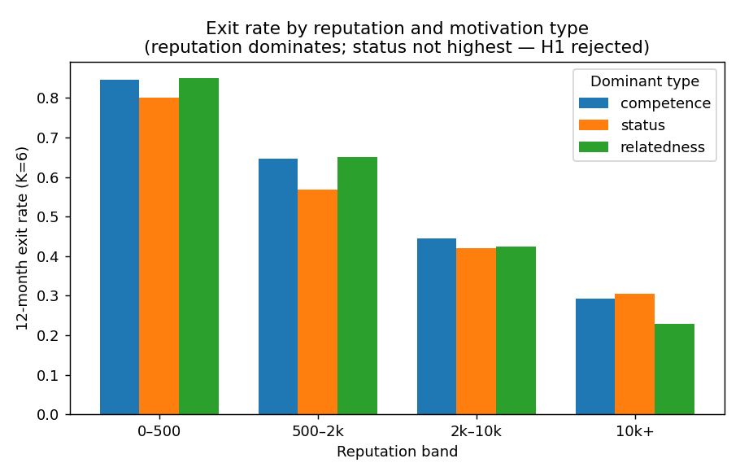
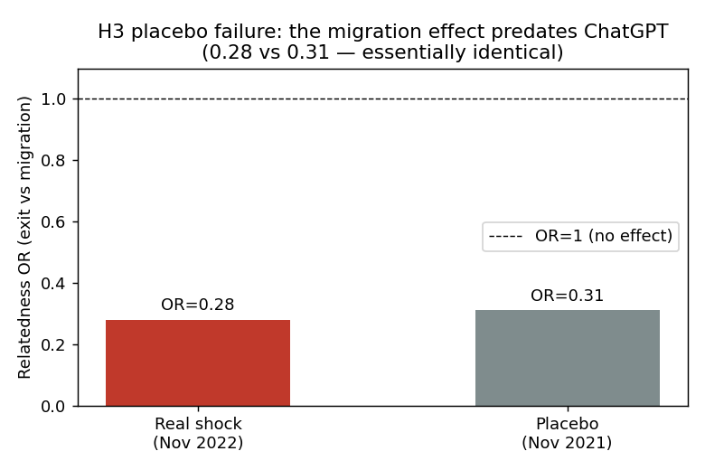
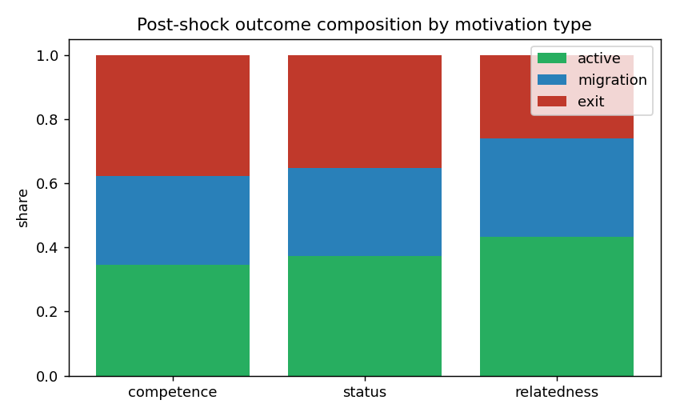

# The Motivation–Behaviour Structure of an Online Knowledge Community Is Stable Across a Generative-AI Shock: A Pre-Registered Null Result

**Status:** Working paper / internal write-up (not submitted for publication).
**Data & code:** `so_sdt_study/` in this repository. Pre-registration frozen 2026-05-30
in `DESIGN.md` before any post-shock outcome data was examined.

---

## Abstract

When ChatGPT made high-quality programming answers instantly available (30 November 2022),
Stack Overflow's contribution volume fell sharply — a decline now documented by several
studies. A natural follow-up question is *psychological*: did the shock fall unevenly on
contributors depending on **why** they participated? Self-Determination Theory and
latent-function accounts of work suggest that people who answer questions for **status**
(reputation, recognition) should be hit hardest when AI collapses the scarcity of good
answers, while those who participate for **relatedness** (community, interaction) should be
insulated. We pre-registered three predictions, classified 50,305 core contributors by the
motivation their *pre-shock* behaviour revealed (competence/mastery, status, relatedness),
and tested differential **exodus** (survival analysis) and **exit-versus-migration** after
the shock. **All three pre-registered predictions failed as stated.** Status-driven
contributors were the *most* retained, not the least (Cox HR = 0.86, controlling for
reputation, volume, tenure). The one striking pattern that survived — relatedness-driven
contributors migrate to comment/edit roles rather than leaving (logit OR = 0.28, p < 0.001)
— was **reproduced almost exactly by a placebo shock one year earlier** (OR = 0.31), before
ChatGPT existed. We conclude that motivation type robustly predicts contributor behaviour,
but the motivation–behaviour structure is **stable across the shock**: ChatGPT reduced
overall activity without selectively restructuring *who leaves* or *how they stay* along
motivational lines. This is a pre-registered, placebo-controlled null result that contradicts
the intuitive "AI selectively hollows out communities" narrative.

---

## 1. Introduction

The arrival of ChatGPT (30 November 2022) coincided with a steep decline in activity on
Stack Overflow (SO). Difference-in-differences and event-study analyses estimate drops of
roughly 16–25% within months (del Rio-Chanona et al., 2024, *PNAS Nexus*; Burtch et al.,
2024, *Scientific Reports*), with the decline concentrated among casual and newer users
(Quinn & Gutt, 2025, *JMIS*) and high-reputation answerers reporting demotivation (Li & Kim,
2024, *Marketing Letters*). A separate study using a Cox model on *inter-answer duration*
found that adopters answer *faster* after using AI (Shan & Qiu, forthcoming *ISR*).

Every one of these studies measures activity **volume or quality** and segments users by
**volume, tenure, or reputation**. None asks the psychological question: do contributors who
participate for different **reasons** respond differently? Laboratory work shows that AI
assistance can undermine intrinsic motivation, self-efficacy, and the sense of meaningful
work (e.g. *Sci. Rep.* 2025/2026; CHI 2026 "Are We Automating the Joy Out of Work?"), but
this mechanism has never been connected to *observed exodus* in a real community.

We set out to build that bridge using Self-Determination Theory (SDT; Deci & Ryan, 2000),
which identifies competence, relatedness, and autonomy as basic psychological needs. On a
Q&A platform, answering can serve different needs for different people, and AI should
threaten those needs unequally:

- **Competence/mastery-seekers** answer hard problems to build skill. AI removes *easy*
  questions but not the hard frontier, so their need can still be met → should be retained.
- **Status-seekers** answer for reputation and the scarcity-value of being the one who knows.
  AI makes good answers abundant and instant, collapsing that scarcity → should leave fastest.
- **Relatedness-seekers** answer for community and recurring interaction. AI provides no
  community → their need is AI-resistant → should stay, or shift to other social roles.

This yields three pre-registered hypotheses (frozen in `DESIGN.md`, §2, before any post-shock
data was seen):

- **H1.** After the shock, the hazard of contributor exodus orders **status > competence ≥
  relatedness**, controlling for pre-shock volume, tenure, and reputation.
- **H2.** Among stayers, competence-driven contributors shift toward harder questions.
- **H3.** Among those who stop answering, status-driven contributors **exit** (no substitute
  outlet) while relatedness-driven contributors **migrate** to comment/edit roles —
  i.e. the community restructures along motivation lines rather than uniformly shrinking.

We report what the data actually showed. It was not what we predicted.

---

## 2. Data and Methods

### 2.1 Data

Public Stack Exchange data (Stack Overflow), accessed via the Stack Exchange Data Explorer.
The analysis cohort is **50,305 core contributors**: registered ≥ 3 months before the shock
and posting ≥ 5 answers in the 12-month classification window (2021-11-30 to 2022-11-29). We
deliberately study contributors (the population whose meaning-bearing activity AI targets),
not the larger pool of askers.

### 2.2 Motivation typing (frozen before outcomes)

Using **pre-shock behaviour only**, each contributor received three volume-invariant indices,
each capturing *style* rather than *amount* of participation:

- **Competence proxy** — share of answers to hard questions (few eventual answers).
- **Status proxy** — share of answers to already-crowded, high-traffic questions (competing
  for marginal reputation).
- **Relatedness proxy** — comments per answer, and edits of *others'* posts (community
  maintenance), z-averaged.

Indices were z-scored across the cohort. The **continuous** z-scores are the primary
predictors; an **argmax dominant type** (competence 23,768 / status 18,771 / relatedness
7,766) is a companion for interpretation. Crucially, no outcome variable enters the
classifier, and the formula was frozen in `DESIGN.md` before post-shock data was examined.

The typing has genuine discriminant validity: each type scores highest on its own proxy
(competence 0.64, status 0.52, relatedness 5.53 on the diagonal of the type × proxy table).

### 2.3 Outcomes (post-shock)

- **Exodus (survival):** time from the post-shock outcome window (2023-02-01, after a
  two-month washout) to a contributor's last answer; "exited" = no answers for ≥ K months,
  with **K = 3, 6, 9 all reported** (6 headline).
- **Exit vs migration (H3):** among answer-stoppers, *exit* = also stopped commenting and
  editing; *migration* = kept/continued comments or edits. (Votes are anonymous in the public
  dump and could not be used.)

### 2.4 Models

Cox proportional-hazards (statsmodels PHReg) for exodus, with continuous motivation indices
and controls (log pre-shock answer volume, log reputation, tenure). Logistic regression for
exit-vs-migration. **Placebo test:** the entire pipeline shifted back one year (fake shock
2021-11-30; classification 2020-11 to 2021-11; outcome 2022-02 to 2022-11, ending before the
real shock so it stays AI-clean), pre-committed as the identification check.

---

## 3. Results

### 3.1 H1 rejected: status-driven contributors are the *most* retained

Reputation dominates exodus: the 12-month exit rate (K=6) falls monotonically from 82.7% in
the lowest reputation band (0–500) to 27.6% in the highest (10k+). This replicates the known
finding that peripheral contributors leave first.

Against this backdrop, the Cox model (controlling reputation, volume, tenure) shows all three
motivation hazards **below 1** — and **status is the lowest**, the opposite of H1:

| Predictor | HR (K=6) | 95% CI | p |
|---|---|---|---|
| Status (z) | **0.86** | 0.85–0.88 | <0.001 |
| Relatedness (z) | 0.94 | 0.92–0.97 | <0.001 |
| Competence (z) | 0.98 | 0.96–0.99 | 0.003 |
| log reputation | 0.76 | 0.75–0.77 | <0.001 |

The ordering is identical at K=3 and K=9. **H1 is rejected:** stronger status motivation
predicts *lower*, not higher, exodus risk. (A descriptive reversal at the very top reputation
band was tested with a status × reputation interaction and found non-significant, HR = 1.002,
p = 0.52 — i.e. noise, not a finding.)

*Figure 1. Twelve-month exit rate by reputation band and motivation type. Reputation dominates
(exit falls from ~83% to ~28% across bands); within bands, status-driven contributors are not
the most likely to leave, contradicting H1.*

We attribute the reversal of H1 to a measurement reality: our "status proxy" (answering
popular, crowded questions) captures *mainstream, high-engagement* contributors, who are
simply stickier — not contributors whose participation is fragile to the collapse of answer
scarcity. Competence and status proxies are also strongly negatively correlated (r = −0.77;
they are two ends of one "hard vs popular question" axis), so the competence/status contrast
is not cleanly identified.

### 3.2 H3 pattern is real but not caused by the shock

The one strong, theory-shaped pattern: among contributors who stopped answering, stronger
relatedness motivation predicts **migration rather than exit** (logit OR = 0.28, p < 0.001),
holding in every reputation band. Relatedness-driven contributors who stop answering tend to
remain as commenters/editors rather than disappear. Overall, of the cohort, 36.9% stayed
active, 34.9% exited, and 28.1% migrated.

This looked like clean support for H3 — until the placebo. **At a fake shock one year earlier,
before ChatGPT existed, the same effect appears almost identically:**

| | Relatedness OR (exit vs migration) |
|---|---|
| Real shock (Nov 2022, ChatGPT) | 0.28 (p < 0.001) |
| Placebo shock (Nov 2021, no AI) | **0.31** (p < 0.001) |

Because the placebo reproduces the effect, the identification fails: the migration pattern is
a **stable trait** of relatedness-driven contributors (they have always been more likely to
linger as commenters than to vanish), **not a response to ChatGPT.** Per the pre-registered
rule (`DESIGN.md` §7), H3's causal interpretation is rejected.

*Figure 2. The relatedness migration effect (odds of exit vs migration) is essentially
identical at the real ChatGPT shock and at a placebo shock one year earlier, before ChatGPT
existed — so it is not caused by the shock.*

*Figure 3. Post-shock outcome composition by motivation type. Relatedness types migrate
somewhat more and exit somewhat less, but the differences are modest and (per Figure 2) not
shock-induced.*

### 3.3 What the data does show

Motivation type robustly *predicts* contributor behaviour — status types are stickier,
relatedness types migrate rather than vanish, competence types answer harder questions — but
these are **stable structural features of the community**, present before the shock and
essentially unchanged after it. ChatGPT lowered the overall level of activity without
selectively reshaping *who leaves* or *how they stay* along motivational lines.

---

## 4. Discussion

### 4.1 A null result, honestly arrived at

All three pre-registered predictions failed: H1 was reversed, the apparent top-tier reversal
was noise, and H3's causal claim was killed by the placebo. We resisted three tempting moves
that would have manufactured a positive result: redefining "status" post-hoc to fit H1 once
we had seen the outcomes; writing up the non-significant reputation reversal as an exploratory
finding; and skipping the placebo. Each was declined precisely because the design was frozen
in advance. The placebo test, in particular, caught an effect that would otherwise have been
published as a causal discovery.

### 4.2 Why the structure is stable

Three factors plausibly explain the null. First, SO's decline is **gradual and diffuse** (it
was already falling before late 2022), not a clean discontinuity, so cross-shock stability is
unsurprising. Second, **behavioural proxies measure stable dispositions, not reactions**:
relatedness types comment more *by temperament*, which any time window will reveal — exactly
what the placebo exposed. Third, and most fundamentally, the psychological reaction we hoped
to detect (AI eroding need-satisfaction) is a **latent state**, and behavioural traces on a
platform capture stable propensities far better than they capture shock-induced motivational
change. This is the core limitation of using behavioural data as a proxy for a psychological
construct.

### 4.3 Contribution

The result contradicts an intuitive and increasingly popular narrative — that generative AI
*selectively* drains communities by driving out particular kinds of contributors. In this
large, pre-registered, placebo-controlled analysis, we find no such selective restructuring
along motivational lines on Stack Overflow. The aggregate decline is real; its *composition*
by contributor motivation is not detectably shock-driven.

### 4.4 Limitations

- **Behaviour ≠ motivation.** Our types are inferred from behaviour, not measured
  psychologically; they capture disposition, not reaction (this is also why the placebo
  caught the H3 pattern). A design using *content* (e.g. language signalling frustration or
  efficacy loss) might detect reactions that behaviour cannot.
- **Competence/status not cleanly separated** (r = −0.77 between proxies).
- **Autonomy** has no clean behavioural proxy on SO and was folded into competence.
- **Votes** are anonymous in the public dump, narrowing "migration" to comments and edits.
- **One platform, one shock.** SO is transaction-oriented; relatedness may matter more — and
  behave differently — on community-oriented platforms.
- Stack Overflow's own gradual decline is a confound the year-on-year and placebo designs
  mitigate but cannot fully remove.

### 4.5 What would actually test the psychological claim

The honest lesson is that the original psychological question — *does AI erode the
need-satisfaction that sustains contribution?* — needs an instrument that captures
**reaction**, not disposition. Two routes: (a) analyse the **text** contributors write before
leaving (LLM-coded SDT signals: frustration, efficacy loss, status-devaluation), validated
against human coding; (b) study a platform with a **sharper, more localised** AI shock than
SO's diffuse decline. Both are left for future work.

---

## 5. Conclusion

We asked whether generative AI reshaped *who contributes and why* on Stack Overflow. Using
50,305 contributors, pre-registered hypotheses, survival analysis, and a placebo control, the
answer is: motivation type predicts behaviour, but that structure did not measurably change
across the ChatGPT shock. It is a clean null — and, because it was pre-registered and
placebo-controlled, a trustworthy one. The community got smaller; it did not, by these
measures, get selectively hollowed out along motivational lines.

---

## Author's note on provenance

This study was conducted as an independent, spare-time research project with heavy use of an
AI coding assistant for literature verification, data pipeline construction, statistical
analysis, and drafting. All four closest prior papers were read in full from primary text.
The pre-registration was frozen before outcome data was examined, and the placebo test was
pre-committed; the null result is reported as found. Data and code are in this repository for
full reproducibility.

## References

- del Rio-Chanona, R. M., Laurentsyeva, N., & Wachs, J. (2024). Are large language models a
  threat to digital public goods? *PNAS Nexus*.
- Burtch, G., Lee, D., & Chen, Z. (2024). The consequences of generative AI for online
  knowledge communities. *Scientific Reports*, 14, 10413.
- Quinn, M., & Gutt, D. (2025). Heterogeneous effects of generative AI on knowledge seeking in
  online communities. *Journal of Management Information Systems*, 42(2).
- Li, X., & Kim, K. (2024). Impacts of generative AI on user contributions: evidence from a
  coding Q&A platform. *Marketing Letters*, 36, 577–591.
- Shan, G., & Qiu, L. (forthcoming). Examining the impact of generative AI on users' voluntary
  knowledge contribution: evidence from a natural experiment on Stack Overflow. *Information
  Systems Research*.
- Deci, E. L., & Ryan, R. M. (2000). The "what" and "why" of goal pursuits. *Psychological
  Inquiry*, 11(4), 227–268.
